## UML Class Diagram

```mermaid
classDiagram
    direction LR

    class Particle {
        +float r_mcc
        +float cx
        +float cy
        +float cz
        +bool isdrawn
        +bool isboundary
        +__init__(r_mcc: float, center: tuple)
        #_is_within_bounds(img_shape: tuple) bool
        #_touches_boundary(img_shape: tuple) bool
        +overlap_with(r_mcc: float, cx: float, cy: float, cz: float) bool
        +__repr__() str
    }

    class CircularParticle {
        +float size_A
        +float size_x_A
        +float size_x_Fmax
        +float size_x_Fmin
        +float size_x_Lmax
        +float size_x_Lmin
        +float size_P
        +__init__(myshape: PShape, x_ecd: float, center: tuple, rotation: float = 0)
        +draw(image: np.ndarray, ForegroundBrightness: int, exclude_border: bool) None
        +__repr__() str
    }

    class EllipseParticle {
        +float x_major
        +float x_minor
        +float rotation
        +float size_A
        +float size_x_A
        +float size_x_Fmax
        +float size_x_Fmin
        +float size_x_Lmax
        +float size_x_Lmin
        +__init__(myshape: PShape, x_ecd: float, center: tuple, rotation: float = 0)
        #_touches_boundary(img_shape: tuple) bool
        +draw(image: np.ndarray, ForegroundBrightness: int, exclude_border: bool) None
        +__repr__() str
    }

    class PShape {
        <<Abstract>>
        +float ratio
        +__init__(ratio: float)
        +__repr__() str
        +radius_mcc(x_ecd: float) float*
        +area(x_ecd: float) float
        +perimeter(x_ecd: float) float*
        +get_particle_from_size(x_ecd: float, center: tuple, rotation: float = 0) Particle*
    }

    class PShapeCircle {
        +float aspect_ratio
        +float ellipse_ratio
        +__init__()
        +radius_mcc(x_ecd: float) float
        +perimeter(x_ecd: float) float
        +get_particle_from_size(x_ecd: float, center: tuple, rotation: float = 0) CircularParticle
    }

    class PShapeEllipse {
        +float aspect_ratio
        +float ellipse_ratio
        +__init__(ratio: float)
        +radius_mcc(x_ecd: float) float
        +perimeter(x_major: float, x_minor: float) float
        +get_particle_from_size(x_ecd: float, center: tuple, rotation: float = 0) EllipseParticle
    }

    class ImageGenerator {
        +int width
        +int height
        +int depth
        +int background_brightness
        +PShape pshape
        +float x_median
        +float sigma_x
        +bool ismonodisperse
        +list particles_sizes
        +list boundary_particles
        -list particles # Current image particles
        +__init__(aShape: PShape, FOVWidth: int, FOVHeight: int, SVDepth: int, BackgroundBrightness: int)
        +set_psd(x_median: float, x_stdev: float, strict_monodisperse: bool) None
        +reset_particles_data() None
        #_draw_particles(image: np.ndarray, foreground_brightness: int, exclude_border: bool) None
        #_place_particle(size: float, min_spacing: float) None
        #_generate_particle_sizes(num_particles: int) np.ndarray
        +getimage(num_particles: int, foreground_brightness: int, exclude_border: bool, min_spacing: float) np.ndarray
    }

    class compute_psd {
        <<utility function>>
        +compute_psd(particle_sizes: np.ndarray, x_min: float, x_max: float, nbins: int) tuple
    }

    Particle <|-- CircularParticle
    Particle <|-- EllipseParticle

    PShape <|-- PShapeCircle
    PShape <|-- PShapeEllipse

    ImageGenerator o-- PShape : uses shape >
    ImageGenerator ..> Particle : manages/draws >
    ImageGenerator ..> compute_psd : (potentially uses results)

    PShapeCircle ..> CircularParticle : <<creates>>
    PShapeEllipse ..> EllipseParticle : <<creates>>

    CircularParticle ..> PShape : uses >
    EllipseParticle ..> PShape : uses >

    note "SuperEllipseParticle and PShapeSuperEllipse are commented out in the code."

```

**Diagram Legend:**

*   `<|--`: Inheritance (e.g., `CircularParticle` inherits from `Particle`)
*   `o--`: Aggregation (e.g., `ImageGenerator` has a `PShape` instance)
*   `..>`: Dependency (e.g., `ImageGenerator` depends on `Particle`, `PShapeCircle` creates `CircularParticle`)
*   `+`: Public attribute/method
*   `#`: Protected attribute/method (Python convention: starts with `_`)
*   `-`: Private attribute/method (Python convention: starts with `__`)
*   `<<Abstract>>`: Denotes an abstract class (cannot be instantiated directly).
*   `{abstract}`: Denotes an abstract method (must be implemented by subclasses).
*   `<<utility function>>`: Indicates a standalone function, not a class method.
*   `<<creates>>`: Stereotype indicating a creation relationship.

---

## Documentation of the Structure

This Python module provides classes and functions for generating synthetic 2D images containing representations of 3D-placed particles, primarily intended as reference images for image analysis algorithm testing and validation. It also includes a utility function for analyzing the particle size distribution (PSD) of the generated particles.

**Core Concepts:**

1.  **Separation of shape and particle instance:** The structure separates the definition of a particle's *shape* (`PShape` and its subclasses) from the actual *particle instance* (`Particle` and its subclasses) which has a specific size, position, and potentially orientation.
2.  **3D placement, 2D drawing:** Particles are assigned a 3D center coordinate (`cx`, `cy`, `cz`) within a defined sampling volume (`FOVWidth`, `FOVHeight`, `SVDepth`). However, they are drawn onto a 2D image plane (`numpy` array) based on their `cx`, `cy` coordinates and shape parameters. The `cz` coordinate is used primarily for 3D overlap checks.
3.  **Overlap check:** A simplified overlap check based on the *minimum circumscribed circle* (`r_mcc`) radius is implemented in the `Particle` base class to prevent particles from being placed too close to each other in 3D space.
4.  **Size parameterization:** Particles are primarily sized using the *equivalent circular diameter* (`x_ecd`), which is the diameter of a circle having the same area as the particle's 2D projection. Specific shape classes (`PShapeCircle`, `PShapeEllipse`) use this `x_ecd` and their intrinsic properties (like `ratio`) to derive other size parameters (major/minor axes, etc.).
5.  **Image generation:** The `ImageGenerator` class manages the overall process of creating an image, including defining the sampling volume, setting the particle size distribution, randomly placing non-overlapping particles in 3D, and drawing them onto a blank image.

**Key Components:**

1.  **`Particle` (base class):**
    *   **Responsibility:** Represents the fundamental properties of any particle. Its 3D center (`cx`, `cy`, `cz`) and a radius (`r_mcc`) used for basic spatial checks (overlap, boundary). Tracks if it has been drawn (`isdrawn`) and if it touches the image boundary (`isboundary`).
    *   **Key Methods:** `__init__`, `overlap_with`.
    *   **Relationship:** Parent class for specific particle types like `CircularParticle` and `EllipseParticle`.

2.  **`CircularParticle` / `EllipseParticle` (concrete particle classes):**
    *   **Responsibility:** Represent specific particle types that can be drawn. They inherit position and basic properties from `Particle`. They calculate and store various ISO size parameters based on their shape and initial `x_ecd`. They implement the `draw` method using `skimage.draw` functions (`disk`, `ellipse`) to render themselves onto a `numpy` image array.
    *   **Key Methods:** `__init__`, `draw`. `EllipseParticle` also overrides `_touches_boundary` for more accurate ellipse boundary checking.
    *   **Relationship:** Inherit from `Particle`. Initialized with a corresponding `PShape` object and `x_ecd`.

3.  **`PShape` (abstract base class):**
    *   **Responsibility:** Defines the *interface* for a particle shape, independent of size or location. It stores a fundamental `ratio` (e.g., aspect ratio) and declares abstract methods (`radius_mcc`, `perimeter`, `get_particle_from_size`) that concrete shape classes must implement. It provides a concrete `area` method based on `x_ecd`.
    *   **Key Methods:** `__init__`, abstract methods.
    *   **Relationship:** Parent class for specific shape definitions like `PShapeCircle` and `PShapeEllipse`.

4.  **`PShapeCircle` / `PShapeEllipse` (concrete shape classes):**
    *   **Responsibility:** Implement the `PShape` interface for specific geometries (circle, ellipse). They define how to calculate the `radius_mcc`, `perimeter`, and importantly, provide a factory method (`get_particle_from_size`) to create the corresponding concrete `Particle` object (`CircularParticle`, `EllipseParticle`) when given an `x_ecd` and center coordinates.
    *   **Key Methods:** `__init__`, implementation of abstract methods from `PShape`, `get_particle_from_size`.
    *   **Relationship:** Inherit from `PShape`. Used by `ImageGenerator` to define the type of particles to generate. The `get_particle_from_size` method creates instances of `CircularParticle` or `EllipseParticle`.

5.  **`ImageGenerator` (class):**
    *   **Responsibility:** Implements the entire image generation process. It holds the configuration (image dimensions, background, particle shape via a `PShape` instance, PSD parameters). It generates particle sizes according to the specified distribution (log-normal or monodisperse), attempts to place them without overlap in the 3D volume using the `_place_particle` helper method (which calls `Particle.overlap_with`), and then calls the `draw` method of each successfully placed particle via `_draw_particles`. It accumulates statistics about generated particles (`particles_sizes`, `boundary_particles`).
    *   **Key Methods:** `__init__`, `set_psd`, `getimage`, `reset_particles_data`.
    *   **Relationship:** Aggregates a `PShape` object. Manages and interacts with `Particle` objects (created via the `PShape` object's factory method).

6.  **`compute_psd` (utility function):**
    *   **Responsibility:** A standalone function to calculate the cumulative particle size distribution (Q0) from an array of particle sizes. It uses logarithmic binning and interpolation to find specific percentiles (x10, x16, x50, etc.).
    *   **Relationship:** Independent utility, typically used after `ImageGenerator` has produced a set of particle sizes. Depends on `numpy` and `math`.

**Workflow Example (based on `if __name__ == "__main__":`)**

1.  A specific shape object is created (e.g., `my_shape = PShapeEllipse(ratio=0.75)`).
2.  An `ImageGenerator` is instantiated with this shape object and image/volume dimensions.
3.  Particle size distribution parameters are set using `image_generator.set_psd(...)`.
4.  A loop calls `image_generator.getimage(...)` multiple times.
    *   Inside `getimage`:
        *   Particle sizes are generated (`_generate_particle_sizes`).
        *   For each size, `_place_particle` is called:
            *   A random 3D position is chosen.
            *   The required `r_mcc` is obtained from `self.pshape.radius_mcc(size)`.
            *   Overlap check (`Particle.overlap_with`) is performed against existing particles in the current image's list (`self.particles`).
            *   If no overlap, `self.pshape.get_particle_from_size(...)` creates the specific `Particle` object (e.g., `EllipseParticle`), which is added to `self.particles`.
        *   `_draw_particles` iterates through `self.particles`, calling each particle's `draw` method to modify the `numpy` image array. Cumulative size/boundary data is stored in `self.particles_sizes` / `self.boundary_particles`.
    *   The generated `numpy` image is returned.
5.  After generating all images, the collected `image_generator.particles_sizes` are processed by `compute_psd` to analyze the resulting size distribution.

*(Note: The `SuperEllipseParticle` and `PShapeSuperEllipse` classes are commented out in the provided code but would follow the same structural pattern if enabled.)*